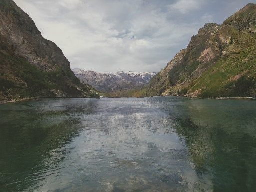

# Jittor 风格及语义引导的风景图片生成赛道 ECGAN

COESAK战队在第三届计图（jittor）人工智能挑战赛-风格及语义引导的风景图片生成赛道的方案。

## 实现结果

   

## 赛题说明

图像生成任务一直以来都是十分具有应用场景的计算机视觉任务，从语义分割图生成有意义、高质量的图片仍然存在诸多挑战，如保证生成图片的真实性、清晰程度、多样性、美观性等。

其中，条件图像合成，即输入图片数据，合成真实感图片，在内容生成与图片编辑领域有广泛应用。一种条件图像合成的方式是，用两张图片作为输入，经过处理转换后生成一张新的图片，其中一张输入为语义分割图片（称为mask图），指示生成图片（称为gen图）的语义信息；另一张输入为参考风格图片（称为ref图），从色调等方面指示gen图的风格信息。

清华大学计算机系图形学实验室从Flickr官网收集了12000张高清（宽512、高384）的风景图片，并制作了它们的语义分割图。其中，10000对图片被用来训练。训练数据集可以从[这里](https://cloud.tsinghua.edu.cn/f/063e7fcfe6a04184904d/?dl=1)下载。其中 label 是值在 0~28 的灰度图，可以使用 matplotlib.pyplot.imshow 可视化。

## 赛题内容

本赛题将会提供1000张测试分割图片作为mask图，每张mask图会对应一张训练集中的图作为ref图，对应关系用一个json文件给定。

要求参赛选手实现的效果为：根据输入的mask和ref图，输出gen图。gen图需要考虑mask图的语义分割信息，以及ref图的（色调等）风格信息。

## 赛题评测指标

赛题分为A、B两个榜单。A榜结束后将按排名筛选、审核让若干支队伍进入B榜。

A榜评分公式：使用机器评测分。机器评测分 = mask accuary * ( 美学评分 * 20% + ( 风格相似度*0.5 + 0.5 ) * 30% + (100 - FID) / 100 * 50%)

- mask accuary：根据用户生成的1000张图片，使用 SegFormer 模型[1]对图片进行分割，然后计算分割图和gt分割图的mask accuary=(gt_mask == pred_mask).sum() / (H * W)，确保生成的图片与输入的分割图相对应。mask accuary 越大越好，其数值范围是0~1。

- 美学评分：由深度学习美学评价模型为图片进行美学评分，大赛组委会参考论文 [2-4] 中的论文实现自动美学评分。该分数将归一化将到0~1。

- 风格相似度：使用颜色直方图来描述图像颜色特征，用gen图与ref图颜色直方图的相关系数进行评分，其数值范围是-1~1，将归一化到0至1。

- FID（Frechet Inception Distance score）：计算生成的 1000 张图与训练图片的FID，该指标越小越好，将FID的100到0线性映射为 0 到 1。由于 baseline 代码的 FID 在 100 以内，所以 FID 大于 100 的将置为 100。

B榜评分公式：70% 机器评测分 + 10% 专家投票 + 20% 答辩分数 

用户提交B榜生成图片 1000 张，mask accuary、美学评分、风格相似度和 FID 计算方式参考 A 榜指标。此外，选手需要额外自己选择 3 张高质量图片进行投票评选。该3张图片将与进入B组的若干组选手共同接受专家的投票。关于投票具体细节将在A榜结束时公布。

## 数据集文件结构

```bash
--data
    --train
        --imgs
            --train_img0.jpg
            --train_img1.jpg
            ...
        --lables
            --train_img0.png
            --train_img1.png
            ...
    --test
        --val_B_labels_resized
            --test_img0.png
            --test_img1.png
            ...
        --label_to_img.json
```

## 安装

本项目可在 1 张 RTX 3090 上训练及测试。

#### 运行环境
- ubuntu 20.04 LTS
- python >= 3.7
- jittor >= 1.3.0

#### 安装依赖
执行以下命令安装本项目使用的依赖环境。
```
pip install -r requirements.txt
```

## 训练

训练数据集可以从[这里](https://cloud.tsinghua.edu.cn/f/063e7fcfe6a04184904d/?dl=1)下载。

模型的训练可以参考以下命令：

```
python train.py --input_path [训练集路径]
```                       

## 测试

风格图为训练集中图片，因此这里的路径为训练集的路径。

我们已将模型打包，可以直接测试。模型在这里下载 (链接: https://pan.baidu.com/s/1H0PDAfacrc20jDGGgtCVGg?pwd=8gcp 提取码: 8gcp)，下载后的模型请放于./checkpoints/文件夹下。

使用我们提供的预训练模型和参考图像进行测试可以参考以下命令：

```
python test.py --input_path [测试集路径] --img_path [风格图路径] --output_path ./results
```             
生成的参考图像将保存在当前目录下的results文件夹中。

## 致谢

此项目基于论文 *Edge Guided GANs with Semantic Preserving for Semantic Image Synthesis* 实现，部分代码参考了 [ECGAN](https://github.com/Ha0Tang/ECGAN)。
